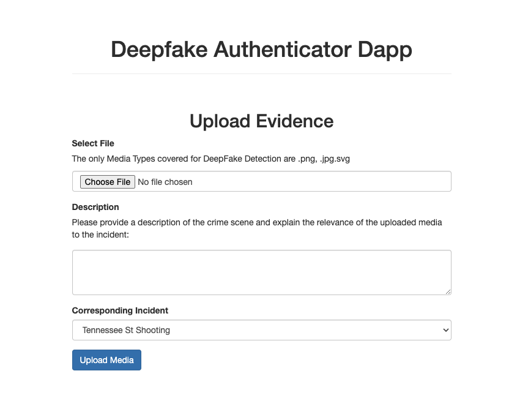

# Deepfake Authenticator Dapp

Spot the Deepfake: Is it the dignified graduate devouring a burger, or the sophisticated wine expert? Our deepfake detector Dapp says... 'Error 404: Reality Not Found!'

## Description

In the digital era, smartphones are essential for documenting life events, often serving as critical evidence in judicial proceedings. However, the widespread distribution of digital evidence across various devices and social media complicates its aggregation and scrutiny for law enforcement agencies. These challenges are exacerbated by computational demands and the emergence of deepfake technology, which facilitates the spread of misinformation, harassment, and manipulation, undermining the integrity of digital evidence.

This project proposes the use of blockchain-based decentralized federated learning applications (Dapps) as a novel solution for authenticating digital evidence. The Deepfake Authenticator Dapp employs a decentralized federated learning framework to facilitate targeted data extraction and improve deepfake detection. It provides digital forensic investigators with a powerful tool for evidence verification, overcoming current obstacles in digital forensics and advancing evidence authentication methodologies. This development aims to strengthen the reliability of digital media in legal contexts.

**Keywords:** Digital Forensics, Federated Learning, Blockchain, Deepfake, Decentralization

## Installation Instructions

### Step 1: Setting up the Environment

- **Ganache Method for Unlimited Free Ethers**
  1. Install Ganache Server or desktop app.
  2. Run Ganache Server or desktop app.
  3. Configure the network in your MetaMask wallet.
  4. Import accounts using a private key provided by Ganache.

   For detailed instructions, visit [How to Load Unlimited Free Ethers to Metamask Wallet](https://dev.to/daltonic/how-to-load-unlimited-free-ethers-to-metamask-wallet-86k).

### Step 2: Start the IPFS Daemon

- This step enables file retrieval through an HTTP web browser. Run `ipfs daemon` in your terminal.
  
  For more information, check out this [IPFS guide](https://flyingzumwalt.gitbooks.io/decentralized-web-primer/content/classical-web/lessons/local-gateway.html).
- If you are facing any CORS Fetch Errors, it would be helpful to run the `ipfs config --json API.HTTPHeaders.Access-Control-Allow-Origin '["http://localhost:3002"]'
ipfs config --json API.HTTPHeaders.Access-Control-Allow-Methods '["PUT", "GET", "POST"]'` commands in your terminal.

### Step 3: Initialize Truffle Dapp

- **First Time Setup:**
  - Build the project with `truffle build`.
  - Compile contract source files using `truffle compile [--list <filter>] [--all] [--network <name>] [--quiet]`.

- **Subsequent Uses:**
  - Deploy contracts with `truffle migrate [--reset]`.
  - For changes in the smart contract, run:
    - `truffle migrate --reset`
    - `truffle deploy --reset`

- **Running the Dapp Locally:**
  - Execute `npm run dev` to start the Dapp.
  - Run `python3 app.py` inside the js folder to start the Flask application locally.
  - To access deepfake detection and fake news detection model results, initiate an API by running `python3 app.py` in a new terminal.

### Resources

- [Dapp University Tutorial](https://www.dappuniversity.com/articles/the-ultimate-ethereum-dapp-tutorial)
- [EfficientNet and Vision Transformers for Video Deepfake Detection](https://github.com/davide-coccomini/Combining-EfficientNet-and-Vision-Transformers-for-Video-Deepfake-Detection)

## Usage Instructions

This project enables users to identify deepfakes. Download datasets for [deepfake detection](https://www.kaggle.com/datasets/manjilkarki/deepfake-and-real-images) and fake news [from this link](https://www.kaggle.com/datasets/emineyetm/fake-news-detection-datasets) and the pretrained models [from this link](https://drive.google.com/drive/folders/1_HYBc7i2XsOCcf-qwAdFSNwR9f_aUY8b?usp=drive_link). For training the models yourself, follow the steps outlined in the provided Jupyter notebooks.

## Contributing

If you're interested in contributing, especially in training LLAMA2 on forensic data or building a digital forensic large language model, please reach out. Your ideas and contributions are welcome.

## Publications

- [Comparison of deepfake detection techniques through deep learning](https://www.mdpi.com/2624-800X/2/1/7)
- [Digital Evidence Acquisition and Deepfake Detection with Decentralized Applications](https://dl.acm.org/doi/abs/10.1145/3491418.3535127)
- [Targeted Data Extraction and Deepfake Detection with Blockchain Technology](https://ieeexplore.ieee.org/abstract/document/10185510)

## License

This project is licensed under [Specify License].

## Acknowledgments

I extend my gratitude to my family, peers, and advisors who supported me throughout my PhD dissertation. If you find this work useful, please consider citing my papers.

